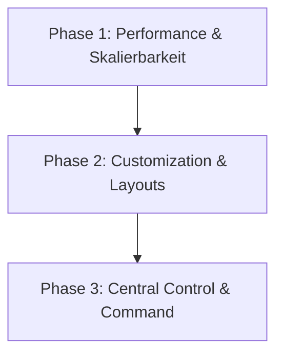

# 🖥️ VGT WP-Desk — Strategic Development Roadmap

Dieses Dokument beschreibt die zukünftigen Meilensteine, Architekturoptimierungen und Funktionserweiterungen für **VGT WP-Desk**. Die Planung folgt konsequent der **Zero-Overheat-Doktrin** (maximale Performance, minimaler Fußabdruck) und entspricht den strengen Kriterien des **DIAMANT VGT SUPREME** Standards.

---

## 📅 Roadmap Übersicht

Die Entwicklung ist in drei strategische Phasen unterteilt, um Stabilität, Skalierbarkeit und Benutzererfahrung kontinuierlich zu maximieren.



---

## 🛠️ Phase 1: Performance & Skalierbarkeit (Architektur-Kritiken)

In dieser Phase werden die identifizierten architektonischen Engpässe behoben, um das System für extrem große WordPress-Installationen und ressourcenbeschränkte Client-Umgebungen zu rüsten.

### 1. Iframe Memory Suspend (Client-Seitige RAM-Optimierung)
*   **Problem:** Wenn viele Anwendungsfenster gleichzeitig geöffnet sind (auch wenn sie minimiert oder im Hintergrund sind), verbrauchen die aktiven `iframe`-Elemente im Browser erhebliche Arbeitsspeichermengen.
*   **Konzept (Hibernation Engine):**
    *   **Automatisches Entladen (Freeze):** Wenn ein Fenster minimiert wird, wird sein Iframe-Inhalt temporär in einen suspendierten Zustand versetzt (z. B. durch Auslesen des Zustands und Ersetzen des Quell-IFrames mit einem Platzhalter oder durch temporäres Einfrieren der JS-Ausführung).
    *   **Hot-Reload on Focus:** Sobald das Fenster wieder maximiert oder fokussiert wird, wird das Iframe nahtlos mit seinem vorherigen Zustand rehydriert.
*   **Vorteil:** Nahezu unbegrenzte Anzahl geöffneter Fenster ohne Einbruch der Browser-Performance.

### 2. Custom Relational Database Migration (Skalierbarkeits-Upgrade)
*   **Problem:** Die Speicherung aller Icon-Positionen, Ordnerstrukturen und Fenstereinstellungen erfolgt aktuell serialisiert in den Zeilen von `wp_usermeta` (`vgt_desk_%`). Bei komplexen Setups mit Hunderten von Elementen führt dies zu großen, monolithischen Datenbankeinträgen, die bei jedem AJAX-Sync komplett gelesen und geschrieben werden müssen.
*   **Konzept:**
    *   **Custom Table:** Migration auf eine dedizierte relationale Datenbanktabelle `{prefix}vgt_desk_settings` (strukturiert nach `user_id`, `setting_key`, `setting_value`, `last_modified`).
    *   **Inkrementelle Updates:** AJAX-Anfragen synchronisieren nur noch veränderte Parameter (Delta-Updates), statt das gesamte Einstellungs-Objekt neu zu serialisieren.
*   **Vorteil:** Massive Reduzierung der DB-Last und des Netzwerk-Traffics bei Speicheroperationen.

### 3. Modularisierung der Desktop Engine (Refactoring von `desktop.js`)
*   **Problem:** Mit über 3.250 Zeilen Code in einer einzigen Datei ist die `desktop.js` schwer zu warten, fehleranfällig bei Änderungen und aufwendig im Sicherheits-Audit.
*   **Konzept (ES6-Modulaufteilung):**
    *   Aufteilung des Monolithen in 5–10 wiederverwendbare, spezialisierte ES6-Module (z. B. `vgt-core.js`, `vgt-window-manager.js`, `vgt-drag-resize.js`, `vgt-icon-grid.js`, `vgt-folder-manager.js`, `vgt-context-menus.js`, `vgt-modals.js`).
    *   Dynamic Loading / Packaging: Verwendung von nativem ES6-Import/Export oder Einführung eines Zero-Overheat Rollup-Skripts zur optionalen Minifizierung für Produktionsumgebungen, um unnötige HTTP-Anfragen zu minimieren.
*   **Vorteil:** Erhebliche Erhöhung der Code-Qualität, leichtere Wartung einzelner UX-Elemente, gezieltes Debugging und performanteres Dynamic-Modul-Loading.

---

## 🎨 Phase 2: Workspace Customization (Multi-Layout Designs)

Um den Desktop an die individuellen Arbeitsweisen anzupassen, wird ein flexibles Theme- und Layout-System implementiert, das verschiedene OS-Paradigmen im einzigartigen VGT-Stil interpretiert.

### 1. Layout-Designs & Skins (Windows, macOS, Linux)
Benutzer können zwischen vordefinierten Layout-Archetypen wechseln, die sich nahtlos an bekannte Betriebssystem-Stile anlehnen, ohne den edlen, glassmorphischen VGT-Stil einzubüßen.

| Layout-Stil | Taskleisten-Position | Startmenü-Typ | Fenster-Steuerung | Besondere Merkmale |
|---|---|---|---|---|
| **VGT Windows (Redmond Grid)** | Unten (linksbündig / zentriert) | Klassischer Grid-Launcher | Oben rechts (Min/Max/Close) | Aero-Snap Vorschau, Widget-Sidebar rechts. |
| **VGT macOS (Cupertino Float)** | Oben (Menüleiste) + Schwebendes Dock unten | Launchpad Overlay | Oben links (Ampel-Design) | Dock-Magnification (Vergrößerungseffekt beim Hover). |
| **VGT Linux (Tux-Custom)** | Seitlich (Dash-to-Dock links) | Kompakt-Launcher oben links | Minimalistisch (nur Schließen/Minimieren) | Maximale Ausnutzung der vertikalen Bildschirmfläche. |

---

## ⚙️ Phase 3: Central Control & Administration (Command Center)

Zusammenführung aller administrativen Einstellungen, Sicherheitsmodule und Systemfunktionen in einer zentralen Steuerungseinheit.

### 1. VGT Command Center
Das Command Center dient als das "Gehirn" des Desktops und ersetzt fragmentierte Einstellungsfenster durch eine konsolidierte Systemsteuerung.

*   **Zentrale Einstellungs-Matrix:**
    *   **Display & Themes:** Wallpaper-Manager, Akzentfarben, Blur-Modus, Layout-Umschalter und Schriftgrößen.
    *   **Sicherheits-Center:** Status von *Throne Guard* und *Sentinel*, Verwaltung des Superkeys, Login-Simulation und IP-Bannlisten.
    *   **Keyboard Shortcuts Mapper:** Konfigurierbare globale Hotkeys (z. B. `Alt + Tab` für Fensterwechsel, `Win + D` zum Desktop anzeigen).
    *   **System Diagnostics:** Echtzeit-Monitor für PHP-Speicherlimit, Server-Auslastung und Datenbankgröße der Desktop-Metadaten.

```
+-------------------------------------------------------------+
| [⚙️ Command Center]                                      -[□][x]|
+-------------------------------------------------------------+
|  System   |  Sicherheit  |  Layouts & Skins  |  Verknüpfung  |
+-----------+--------------+-------------------+---------------+
|                                                             |
|  [Layout auswählen]                                         |
|  ( ) VGT Windows (Standard)                                 |
|  ( ) VGT macOS Style                                        |
|  ( ) VGT Linux Style                                        |
|                                                             |
|  [Performance & Cache]                                      |
|  [x] Iframe-Suspension aktivieren (Spart bis zu 70% RAM)     |
|                                                             |
|  [Tastatur-Kurzbefehle]                                      |
|  Desktop anzeigen:    [ Alt + D          ]                  |
|  Fenster wechseln:    [ Alt + Tab        ]                  |
|                                                             |
+-------------------------------------------------------------+
```

---

## 🛡️ Qualitätsrichtlinien (DIAMANT VGT SUPREME)

Bei allen zukünftigen Implementierungen der Roadmap-Punkte gelten folgende eiserne Regeln:
1.  **Zero External Calls:** Keine CDNs, keine Google Fonts von externen Servern, vollständige Einhaltung von GDPR/DSGVO.
2.  **No Dynamic Script Compilation:** Kein Webpack/Vite im Build-Prozess. Reines, optimiertes ES6+ Vanilla JS und CSS3.
3.  **Strict Security Handening:** Alle Eingaben, URLs und serialisierten Daten müssen strikt validiert, escaped und über Nonce-gesicherte Endpunkte verarbeitet werden.
