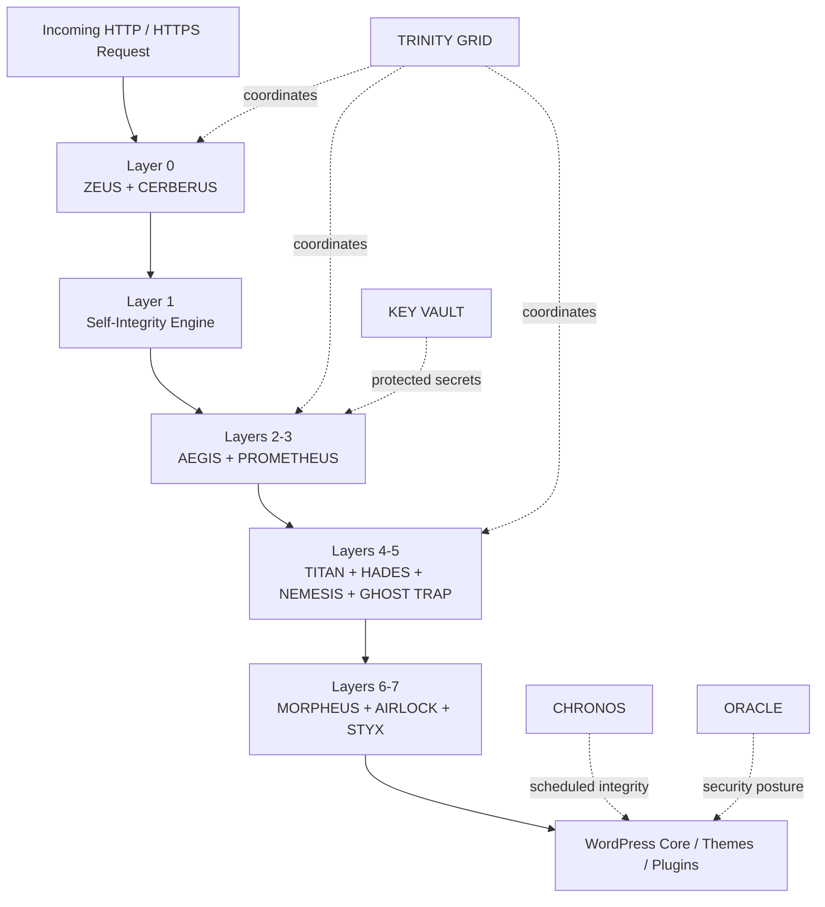

<div align="center">

# 🛡️ GeDefense WP — Open Core

### Sovereign WordPress Security Fabric

[](#)
[](LICENSE)
[](https://www.php.net/)
[](https://wordpress.org/)
[](#zero-dependency-philosophy)
[](#core-module-matrix)
[](#architecture)
[](#zero-dependency-philosophy)
[](#security-design-principles)

**WAF · RASP · BEHAVIORAL DEFENSE · DECEPTION · FILE INTEGRITY · EGRESS CONTROL · HARDENING · CRYPTOGRAPHIC VAULT · OPEN CORE**

</div>

---


## Overview

**GeDefense WP — Open Core** is a modular, zero-dependency WordPress security platform designed as a **multi-tier security kernel and active defense matrix** for PHP 8.1–8.4 and WordPress 6.0+.

Instead of treating WordPress security as a single firewall rule set, GeDefense WP combines multiple defensive layers into one coordinated request and runtime pipeline:

- pre-boot request rejection;
- Web Application Firewall inspection;
- behavioral threat scoring;
- coordinated response orchestration;
- cryptographic self-integrity verification;
- Runtime Application Self-Protection;
- upload and file sanity inspection;
- WordPress hardening;
- admin-path cloaking;
- honeypots and deception;
- zero-trust outbound egress control;
- background integrity scanning;
- cryptographic secrets storage; and
- security posture auditing.

The core is designed to remain **fully functional as an independent open-source security platform**. Optional business and application modules can be added through the Open Core module registry.

> GeDefense WP is built around one principle: **a request should earn trust as it moves deeper into the application stack.**

---

## Table of Contents

- [Architecture](#architecture)
- [Security Pipeline](#multi-phase-ignition-protocol)
- [Core Module Matrix](#core-module-matrix)
- [AEGIS — Deep Packet Inspection WAF](#1-aegis--deep-packet-inspection-waf)
- [PROMETHEUS — Behavioral Threat Horizon](#2-prometheus--behavioral-threat-horizon)
- [TRINITY GRID — Defense Interlock Matrix](#3-trinity-grid--defense-interlock-matrix)
- [Self-Integrity Engine](#4-self-integrity-engine)
- [MORPHEUS — RASP](#5-morpheus--runtime-application-self-protection)
- [NEMESIS — Deception Grid](#6-nemesis--deception-grid)
- [TITAN — WordPress Hardening](#7-titan--wordpress-hardening)
- [HADES — Admin Stealth](#8-hades--dynamic-admin-stealth)
- [CERBERUS — Perimeter Firewall](#9-cerberus--perimeter-firewall)
- [ZEUS — Pre-Boot Filter](#10-zeus--pre-boot-request-filter)
- [AIRLOCK — Upload Inspection](#11-airlock--ingress-file-inspection)
- [GHOST TRAP — Honeypot Layer](#12-ghost-trap--honeypot-layer)
- [STYX — Egress Shield](#13-styx--outbound-egress-shield)
- [CHRONOS — Autonomous Scanner](#14-chronos--autonomous-scanner)
- [KEY VAULT](#15-key-vault--cryptographic-secret-storage)
- [ORACLE — Security Audit](#16-oracle--security-audit-engine)
- [Module Registry / Open Core](#17-module-registry--open-core-expansion)
- [Zero-Dependency Philosophy](#zero-dependency-philosophy)
- [Security Modes](#security-modes)
- [Performance](#performance)
- [Testing](#assurance--regression-testing)
- [Security Design Principles](#security-design-principles)
- [Open Core Model](#open-core-model)
- [Security Disclosure](#security-disclosure)
- [License](#license)
- [Changelog](#changelog)

---

# Architecture

GeDefense WP is organized as a layered security fabric that operates before, during and after normal WordPress execution.

All GeDefense-owned runtime APIs use the canonical `VisionGaia\GeDefense` namespace. Core, dashboard, scanner and module symbols are separated below that root. Pre-8.0 `VisionGaia\Integrity` and `VGT\Sentinel` names are isolated inside the central compatibility boundary. Existing global `VIS_` implementation symbols remain ABI-compatible for WordPress hooks and third-party add-ons, but new integrations must use the canonical API.



The architecture deliberately separates:

```text
Ingress Filtering
       ↓
Behavioral Analysis
       ↓
Integrity Verification
       ↓
WordPress Hardening
       ↓
Deception & Trap Layers
       ↓
Runtime Protection
       ↓
Egress Control
       ↓
Background Integrity & Audit
```

---

# Multi-Phase Ignition Protocol

Incoming requests pass through a deterministic multi-stage pipeline:

```text
[ INCOMING HTTP / HTTPS REQUEST ]
                 │
                 ▼
[ LAYER 0 ]
  ├─ Pre-Boot Invariant Guard
  ├─ CERBERUS L1 Ban Matrix
  └─ ZEUS 6G / Static Fast-Kill Filters
                 │
                 ▼
[ LAYER 1 ]
  └─ Self-Integrity Verification
     └─ Manifest / Merkle Root Validation
                 │
                 ▼
[ LAYERS 2–3 ]
  ├─ AEGIS Deep Packet Inspection
  │   ├─ GET
  │   ├─ POST
  │   ├─ Headers
  │   ├─ JSON
  │   └─ Multipart Metadata
  └─ PROMETHEUS Behavioral Scoring
                 │
                 ▼
[ LAYERS 4–5 ]
  ├─ TITAN Hardening
  ├─ HADES Admin Stealth
  ├─ NEMESIS Deception Grid
  └─ GHOST TRAP
                 │
                 ▼
[ LAYERS 6–7 ]
  ├─ MORPHEUS RASP
  ├─ AIRLOCK File Inspector
  └─ STYX Outbound Egress Shield
                 │
                 ▼
[ WORDPRESS CORE / THEMES / PLUGINS ]
                 │
                 ▼
[ CHRONOS / ORACLE / TELEMETRY / INTEGRITY ]
```

---

# Core Module Matrix

| # | Module | Security Role | Layer / Domain |
|---:|---|---|---|
| 1 | **AEGIS** | Deep Packet Inspection WAF | Ingress / L3-L7 |
| 2 | **PROMETHEUS** | Behavioral Threat Scoring | Behavioral / L7 |
| 3 | **TRINITY GRID** | Coordinated Response Orchestration | Cross-Layer |
| 4 | **SELF-INTEGRITY ENGINE** | Merkle-Based Core Verification | Integrity / L1 |
| 5 | **MORPHEUS** | Runtime Application Self-Protection | Runtime / L7 |
| 6 | **NEMESIS** | Cyber Deception & Canary Grid | Deception / L7 |
| 7 | **TITAN** | WordPress Hardening & Anti-Enumeration | Hardening / L4 |
| 8 | **HADES** | Dynamic Admin Path Cloaking | Identity / L7 |
| 9 | **CERBERUS** | Fast Perimeter Ban Matrix | Pre-Boot / L0-L1 |
| 10 | **ZEUS** | Ultra-Lightweight Pre-Boot Filtering | Pre-Boot / L0 |
| 11 | **AIRLOCK** | File Upload & Entropy Inspection | Ingress / L7 |
| 12 | **GHOST TRAP** | Honeypot & Decoy Route Engine | Deception / L7 |
| 13 | **STYX** | Outbound HTTP / Exfiltration Control | Egress / L7 |
| 14 | **CHRONOS** | Autonomous Integrity Scheduler | Background |
| 15 | **KEY VAULT** | Encrypted Secret Storage | Cryptography |
| 16 | **ORACLE** | Security Configuration Audit | Audit |
| 17 | **MODULE REGISTRY** | Open-Core Expansion Hub | Extensibility |
| 18 | **THRONEGUARD** | Master/Admin Privilege Separation & Superkey Session | Identity / Privilege |
| 19 | **LOGINPAGER** | Local Login Surface Hardening & Branding | Identity / UI |

---

# 1. AEGIS — Deep Packet Inspection WAF

**Classification:** Layer 3/7 Ingress Firewall & Protocol Analyzer  
**Core class:** `VisionGaia\GeDefense\Modules\Aegis\Aegis`
**Path:** `includes/modules/aegis/class-vis-aegis.php`

AEGIS is the primary application-layer request inspection engine.

### Core mechanisms

- two-phase inspection pipeline;
- fast signature matching before deep normalization;
- SQL comment collapsing;
- null-byte normalization;
- quote/slash slicing normalization;
- Unicode homoglyph normalization;
- recursive payload inspection;
- nested JSON analysis;
- multipart upload metadata inspection;
- HTTP header inspection;
- configurable request-body limits;
- compiled-pattern memory caching.

### Detection coverage

AEGIS is designed to identify request patterns associated with:

```text
SQL Injection
├─ Blind
├─ Time-Based
├─ Error-Based
├─ UNION SELECT
└─ Stacked Queries

Cross-Site Scripting
├─ Reflected
├─ Stored
├─ DOM-Oriented Payloads
├─ Tag Smuggling
└─ SVG Event Handlers

Remote Code Execution
├─ eval
├─ assert
├─ system
├─ passthru
├─ preg_replace /e
└─ shell-style execution patterns

File Inclusion
├─ php://filter
├─ data://
├─ expect://
├─ LFI
├─ RFI
└─ directory traversal

Additional Classes
├─ PHP object injection
├─ PHAR-oriented payloads
├─ SSRF
├─ host-header poisoning
└─ ingress header smuggling
```

### Inspection boundaries

Default implementation targets:

```text
Body inspection chunk: 1 MiB
Header inspection limit: 64 KiB
Recursive payload depth: up to 15 levels
```

### Operating modes

**Learning Mode**

- passive inspection;
- security telemetry;
- no automatic IP ban;
- suitable for staging and baseline observation.

**Strict Mode**

- request termination;
- HTTP 403 response;
- threat event forwarded to Prometheus;
- escalation path into Cerberus through the coordinated response matrix.

### Optional AI Oracle Bridge

AEGIS can optionally delegate previously unseen payloads to an external AI analysis bridge configured through the protected key vault.

The AI path is an **optional analytical supplement**, not a replacement for deterministic local security controls.

---

# 2. PROMETHEUS — Behavioral Threat Horizon

**Classification:** Layer 7 Behavioral Analysis & Threat Horizon Engine  
**Namespace:** `VisionGaia\GeDefense\Modules\Prometheus\Prometheus`

Prometheus evaluates behavior across individual clients and network ranges rather than treating every request as an isolated event.

### Threat scoring

Each client can accumulate a dynamic score based on observed behavior.

Example penalty matrix:

| Signal | Example Weight |
|---|---:|
| Disallowed HTTP method | `+30.0` |
| Null-byte / traversal anomalies | `+50.0` |
| Repeated requests to sensitive paths | `+25.0` |
| Burst request frequency | `+20.0` |
| AEGIS WAF strike | `+50.0` |

### Threat decay

Default score decay:

```text
0.2 points / second
```

The decay mechanism allows temporarily suspicious but legitimate clients to recover over time.

### Event horizons

```text
Score 75
   ↓
Pre-Lock Telemetry Threshold

Score 100
   ↓
Cerberus Escalation Threshold
```

### Subnet correlation

Prometheus can correlate behavior across a `/24` network horizon to identify patterns consistent with:

- rotating proxies;
- distributed scanners;
- coordinated bot activity;
- burst reconnaissance.

### Concurrency

Atomic locking strategies and database-lock fallbacks are used to reduce race conditions under high request concurrency.

---

# 3. TRINITY GRID — Defense Interlock Matrix

**Classification:** Cross-Layer Orchestration & Coordinated Response Grid

TRINITY GRID connects four core defensive systems:

```text
          ┌─────────┐
          │  AEGIS  │
          └────┬────┘
               │
               ▼
       ┌──────────────┐
       │  PROMETHEUS  │
       └──────┬───────┘
              │
      ┌───────┴────────┐
      ▼                ▼
┌──────────┐      ┌──────────┐
│ NEMESIS  │      │ CERBERUS │
└──────────┘      └──────────┘
```

### Escalation model

1. AEGIS detects malicious syntax.
2. Prometheus increases behavioral threat score.
3. Repeated activity crosses the deception threshold.
4. Nemesis can move the client into a tarpit or decoy workflow.
5. Persistent hostile behavior crosses the event horizon.
6. Cerberus performs perimeter rejection.

This avoids making every suspicious request an immediate permanent ban while still allowing fast escalation against persistent hostile behavior.

---

# 4. Self-Integrity Engine

**Classification:** Layer 1 Cryptographic Invariant Guard  
**Class:** `VisionGaia\GeDefense\Core\ModuleIntegrity`
**Path:** `includes/core/class-vis-module-integrity.php`

The self-integrity layer verifies critical GeDefense WP components against a cryptographic trust anchor.

### Core mechanisms

- SHA-256 manifest digest;
- `VIS_MANIFEST_DIGEST` trust anchor;
- Merkle-style file verification;
- validation of core security components;
- constant-time comparisons through `hash_equals`;
- immediate integrity mismatch detection.

### Integrity model

```text
Trusted Manifest Digest
          │
          ▼
Component Hashes
          │
          ▼
Merkle / Aggregate Verification
          │
     ┌────┴────┐
     │         │
   MATCH    MISMATCH
     │         │
     ▼         ▼
 Continue   Security Event
```

The mechanism verifies **code integrity**, not the semantic correctness of external data or third-party systems.

---

# 5. MORPHEUS — Runtime Application Self-Protection

**Classification:** Layer 7 In-Memory Execution Protection  
**Namespace:** `VisionGaia\GeDefense\Modules\Morpheus\Morpheus`

Morpheus protects critical WordPress state during runtime.

### Runtime visibility

Morpheus can inspect call-stack context to determine which plugin or component initiated sensitive operations.

### SQL DML protection

Sensitive WordPress tables can be guarded against unauthorized mutation patterns, including:

```text
wp_users
wp_usermeta
```

The objective is to detect or block unexpected operations associated with:

- password manipulation;
- privilege escalation;
- unauthorized administrative state changes.

### SSRF / network guard

Morpheus can block unauthorized outbound requests targeting local or metadata-sensitive destinations such as:

```text
127.0.0.1
localhost
169.254.169.254
```

### Protected WordPress options

Critical options can be monitored or protected, including:

```text
siteurl
home
active_plugins
```

### Modes

**Audit Mode**

- observe internal plugin behavior;
- build an allowed-operation model;
- generate telemetry.

**Enforcement Mode**

- block operations outside the approved security matrix.

---

# 6. NEMESIS — Deception Grid

**Classification:** Layer 7 Counterintelligence & Deception Matrix  
**Namespace:** `VisionGaia\GeDefense\Modules\Nemesis\Nemesis`

Nemesis is the deception layer of GeDefense WP.

### Decoy targets

Examples include simulated high-value paths such as:

```text
.env
wp-config.php.bak
phpmyadmin
```

### Bounded deception responses

Suspicious automated clients receive small, finite decoy responses without exposing real application state or holding PHP workers open.

### Cryptographic canaries

HMAC-SHA256-backed canary values can be inserted into controlled locations for later leak correlation.

### Polymorphic data poisoning

When configured, scraper-facing data can be altered for clients already classified as hostile automation.

### Defensive response boundary

Nemesis is restricted to defensive telemetry, canaries, bounded decoy responses and content deception. Runtime paths do not emit response bombs, cookie bombs, terminal-control payloads or long-running worker delays.

---

# 7. TITAN — WordPress Hardening

**Classification:** Layer 4 System Hardening & Anti-Enumeration Shield  
**Class:** `VisionGaia\GeDefense\Modules\Titan\Titan`
**Path:** `includes/modules/titan/class-vis-titan.php`

Titan reduces unnecessary WordPress exposure.

### Hardening controls

- author-enumeration blocking;
- REST user enumeration protection;
- XML-RPC lockdown;
- file editor lockdown;
- `DISALLOW_FILE_EDIT`;
- WordPress version tag suppression;
- `X-Powered-By` removal;
- server fingerprint reduction.

Example protected routes:

```text
/?author=1
/wp-json/wp/v2/users
/xmlrpc.php
```

---

# 8. HADES — Dynamic Admin Stealth

**Classification:** Layer 7 Identity & Route Cloaking  
**Class:** `VisionGaia\GeDefense\Modules\Hades\Hades`
**Path:** `includes/modules/hades/class-vis-hades.php`

Hades reduces direct exposure of administrative login surfaces.

### Security model

```text
Public Request
      │
      ▼
Standard wp-login.php / wp-admin
      │
      ├─ Authorized Handshake → Admin Session
      │
      └─ No Handshake → 404-style response
```

### Features

- dynamic admin access handshake;
- direct login-route suppression;
- 404 mimicry for unauthorized requests;
- ephemeral session-cookie binding;
- reduced public exposure of administrative entry points.

---

# 9. CERBERUS — Perimeter Firewall

**Classification:** Layer 0/1 Instant Drop Barrier  
**Class:** `VisionGaia\GeDefense\Modules\Cerberus\Cerberus`
**Path:** `includes/modules/cerberus/class-vis-cerberus.php`

Cerberus is designed to reject already-known hostile clients as early as possible.

### Characteristics

- very early boot priority;
- in-memory IP lookup where available;
- APCu/shared-cache support;
- IPv4 and IPv6 CIDR support;
- Cloudflare-aware client-IP validation;
- minimal-response rejection path.

### Goal

```text
Known Hostile Client
       │
       ▼
Memory Lookup
       │
       ▼
Immediate Reject
       │
       └── No Theme Rendering
           No Normal WordPress Page Flow
```

---

# 10. ZEUS — Pre-Boot Request Filter

**Classification:** Layer 0 Ultra-Lightweight Request Filter  
**Class:** `VisionGaia\GeDefense\Modules\Zeus\Zeus`
**Path:** `includes/modules/zeus/class-vis-zeus.php`

Zeus performs low-cost filtering before deeper application inspection.

### Capabilities

- 6G-style blacklist rules;
- malicious query-string filtering;
- bad user-agent filtering;
- referrer anomaly filtering;
- malformed URI rejection;
- emergency recovery / bypass mechanism for misconfiguration.

---

# 11. AIRLOCK — Ingress File Inspection

**Classification:** Layer 7 Ingress Data Sandbox  
**Class:** `VisionGaia\GeDefense\Modules\Airlock\Airlock`
**Path:** `includes/modules/airlock/class-vis-airlock.php`

Airlock evaluates uploaded files using content-aware checks rather than trusting file extensions.

### Inspection mechanisms

- magic-byte verification;
- MIME validation;
- SVG XML sanitization;
- embedded script/event removal;
- `javascript:` payload detection;
- XML entity expansion defense;
- entropy analysis;
- polyglot detection;
- hidden PHP signature detection in image metadata.

### SVG security examples

Airlock is designed to reject or sanitize constructs such as:

```html
<script>
onload=
javascript:
```

and unsafe XML entity expansion patterns.

---

# 12. GHOST TRAP — Honeypot Layer

**Classification:** Layer 7 Active Lure Engine  
**Class:** `VisionGaia\GeDefense\Modules\Trap\GhostTrap`
**Path:** `includes/modules/trap/class-vis-ghost-trap.php`

Ghost Trap generates decoy resources that should never be requested by legitimate users.

Examples:

```text
backup.sql
config.php.bak
database.dump
.aws/credentials
```

Access to a decoy route can be treated as high-confidence automated reconnaissance and escalated into the broader defense matrix.

---

# 13. STYX — Outbound Egress Shield

**Classification:** Layer 7 Egress Control & Supply-Chain Guard  
**Class:** `VisionGaia\GeDefense\Modules\Styx\Styx`
**Path:** `includes/modules/styx/class-vis-styx.php`

Styx monitors outbound WordPress HTTP traffic.

### Core mechanism

Integration point:

```text
pre_http_request
```

### Objectives

- outbound destination control;
- egress allowlisting;
- exfiltration resistance;
- compromised-plugin containment;
- optional restriction of WordPress core telemetry;
- reduced uncontrolled third-party communication.

Styx is especially relevant where WordPress must operate under a **local-first or restricted-egress policy**.

---

# 14. CHRONOS — Autonomous Scanner

**Classification:** Asynchronous Background Integrity Daemon  
**Class:** `VisionGaia\GeDefense\Modules\Chronos\Chronos`
**Path:** `includes/modules/chronos/class-vis-chronos.php`

Chronos performs scheduled integrity and filesystem monitoring.

### Configurable intervals

Example schedules range from:

```text
15 minutes
      ↓
hourly
      ↓
multi-hour
      ↓
daily
```

### Monitored areas

- GeDefense Core;
- WordPress Core;
- plugins;
- themes;
- selected application paths.

### Alerting

Alert templates can include variables such as:

```text
{site_url}
{timestamp}
{details}
```

---

# 15. KEY VAULT — Cryptographic Secret Storage

**Classification:** Cryptographic Key Management  
**Class:** `VisionGaia\GeDefense\Modules\Vault\KeyVault`

The Key Vault protects sensitive configuration values such as API credentials and module tokens.

### Cryptographic mechanisms

Supported design includes:

- Libsodium Secretbox;
- AES-256-GCM;
- authenticated encryption;
- AAD-style identifier binding;
- protected API-key storage.

Example secret classes:

```text
AI Provider Keys
Nexus Tokens
Private Integration Secrets
Module Credentials
```

Sensitive values should never be committed to the repository.

---

# 16. ORACLE — Security Audit Engine

**Classification:** Static Security & Configuration Auditing  
**Class:** `VisionGaia\GeDefense\Modules\Oracle\Oracle`
**Path:** `includes/modules/oracle/class-vis-oracle.php`

Oracle evaluates WordPress and PHP security posture across twelve primary vectors.

| # | Audit |
|---:|---|
| 1 | `wp-config.php` protection |
| 2 | `debug.log` secrecy |
| 3 | file-editor lockdown |
| 4 | WordPress salt entropy |
| 5 | database prefix hardening |
| 6 | default `admin` account check |
| 7 | user-ID enumeration protection |
| 8 | HTTPS / TLS enforcement |
| 9 | server-signature exposure |
| 10 | PHP display-errors posture |
| 11 | directory browsing protection |
| 12 | authentication-header propagation |

---

# 17. MODULE REGISTRY — Open Core Expansion

**Classification:** Extensible Module Architecture  
**Class:** `VisionGaia\GeDefense\Core\ModuleRegistry`
**Path:** `includes/core/class-vis-module-registry.php`

The module registry provides the expansion layer for GeDefense WP Open Core.

The core remains independently usable while optional modules can be distributed as signed or separately packaged extensions.

### Planned / available ecosystem modules

#### Vision Legal Pro — VLP

Privacy and compliance-oriented functionality, including:

- privacy controls;
- local asset mirroring;
- consent-oriented workflows;
- local-first data handling.

#### Lightweight Builder

A high-performance visual layout and component system designed to avoid heavyweight page-builder overhead.

#### GEO Architect

Generative Engine Optimization and semantic entity tooling for AI-oriented search and discovery systems.

---

---

# 18. THRONEGUARD — Sovereign Privilege Sentinel

**Classification:** Layer 7 Privilege Boundary & Identity Hardening  
**Core class:** `VisionGaia\GeDefense\Modules\ThroneGuard\ThroneGuard` (`VIS_Throne_Guard`)  
**Path:** `includes/modules/throneguard/class-vis-throne-guard.php`

ThroneGuard enforces a strict cryptographic privilege boundary between sovereign **GeDefense Master** accounts and standard WordPress **Administrator** accounts.

### Core mechanisms

- **Sovereign Master Role (`master`)**: Introduces a dedicated, immutable role tier above standard WordPress administrators.
- **Granular Admin Capability Matrix**: Empowers Masters to selectively strip toxic capabilities from standard administrators across 4 critical attack vectors:
  - *Plugins:* `activate_plugins`, `install_plugins`, `update_plugins`, `delete_plugins`, `edit_plugins`
  - *Themes:* `switch_themes`, `install_themes`, `update_themes`, `delete_themes`, `edit_themes`
  - *Users & Privilege Escalation:* `create_users`, `promote_users`, `delete_users`, `edit_users`
  - *System & Filesystem:* `update_core`, `unfiltered_html`, `edit_files`
- **Dynamic Capability Reconciliation**: Automatically reconciles role permissions on login, user mutations, and option updates to prevent rogue privilege elevation.
- **Zero-Trust Superkey Lockdown**: Protects `wp-admin` dashboard access and REST API write actions with a cryptographic Superkey (PBKDF2/SHA-256 with CSPRNG salt). Privileged sessions require periodic verification (2-hour sliding window token) and bind to client browser fingerprints.
- **Event Horizon Audit Stream**: Circular buffer security event logger (up to 80 events) tracking Master claims, Superkey changes, role reconciliations, and unauthorized REST manipulation attempts with real-time severity filtering (Critical, Warning, Success, Info) and AJAX log purging.
- **Apex Cyberpunk Cockpit**: High-tech dashboard featuring live telemetry vitals (Master Sovereignty, Superkey Vault, Admin Privilege Filter, Zero-Trust Lockdown) and inline privilege matrix toggles.

---

# 19. LOGINPAGER — Sovereign Login Surface

**Classification:** Authentication Gateway & Visual Hardening  
**Core class:** `VisionGaia\GeDefense\Modules\LoginPager\LoginPager` (`VIS_LoginPager`)  
**Path:** `includes/modules/loginpager/class-vis-loginpager.php`

LoginPager transforms the native WordPress authentication endpoint (`wp-login.php`) into a local-first, zero-dependency, cyberpunk-styled security gateway.

### Core mechanisms

- **Zero External Dependencies:** 100% self-contained inline CSS and SVGs without any Google Fonts, external CDNs, or third-party trackers.
- **Cyberpunk Glassmorphism Surface:** Translucent dark form card (`backdrop-filter: blur()`), glowing accent edge lighting, and geometric background mesh.
- **Adaptive Logo & Branding Fallback:** Intelligently centers custom logos or renders a clean, glowing Portal Title if no image asset is supplied.
- **Real-Time Interactive Cockpit (`view-loginpager.php`):** 2-column cockpit with 5 instant color presets (*Cyber Cyan, Emerald Matrix, Purple Haze, Apex Gold, Crimson Core*), dual color pickers with HEX inputs, custom background/logo URLs, and a 1:1 live preview browser mockup simulator.

# Zero-Dependency Philosophy

GeDefense WP intentionally minimizes third-party runtime dependencies.

### PHP

```php
<?php
declare(strict_types=1);
```

### Design goals

- PHP 8.1–8.4;
- WordPress 6.0+;
- zero external PHP vendor libraries in the core;
- no mandatory Composer runtime dependency;
- optimized project-local autoloading;
- native WordPress / PHP APIs;
- Libsodium where available;
- no mandatory external frontend CDN;
- locally renderable UI assets.

### Why this matters

Every third-party runtime dependency introduces potential:

```text
Supply Chain Risk
Update Risk
Abandonware Risk
Transitive Dependencies
Version Conflicts
Additional Audit Surface
```

The zero-dependency approach does not eliminate software risk, but it deliberately reduces the number of externally controlled runtime components in the trusted computing base.

---

# Security Modes

Several GeDefense modules expose explicit operating modes rather than forcing one universal enforcement profile.

## Learning / Audit

Designed for initial deployment and observation.

```text
Inspect
Log
Score
Baseline
Do Not Aggressively Block
```

## Enforcement / Strict

Designed for hardened deployments.

```text
Inspect
Normalize
Detect
Score
Enforce
Escalate
```

Administrators should baseline legitimate application behavior before enabling aggressive policies on production systems.

---

# Performance

The current GeDefense WP 8.0.0 technical profile defines the following internal benchmark targets/results:

| Metric | GeDefense WP |
|---|---:|
| **L0 rejection latency** | `0.08 ms` |
| **WAF inspection time** | `0.35 ms` |
| **Standby RAM footprint** | `< 1.8 MB` |
| **External PHP dependencies** | `0` |
| **Primary architecture** | Memory-cache first |
| **Control model** | Local / on-premise |

> Performance figures depend on PHP runtime, cache availability, WordPress stack, hosting environment, request shape and enabled security modules. Reproduce benchmarks in your own environment before using them for capacity planning.

---

# Assurance & Regression Testing

The repository includes dedicated regression and benchmark gates.

```bash
php scripts/security-regression.php
php scripts/malware-scanner-regression.php
php scripts/scanner-resumption-regression.php
php scripts/throneguard-loginpager-regression.php
php scripts/aegis-regression.php
php scripts/trinity-regression.php
php scripts/morpheus-regression.php
php scripts/integrity-baseline-regression.php
php scripts/sentinel-threat-benchmark.php
```

These tests are intended to exercise:

- security invariants;
- WAF regression cases;
- Morpheus runtime controls;
- integrity baselines;
- threat-detection behavior;
- performance-sensitive security paths.

A security release should not be treated as validated solely because the plugin activates successfully in WordPress.

---

# Security Design Principles

## 1. Defense in Depth

No single module is treated as the only security boundary.

```text
Pre-Boot
   ↓
WAF
   ↓
Behavior
   ↓
Hardening
   ↓
Runtime Protection
   ↓
Egress Control
   ↓
Integrity
```

## 2. Local First

Security state and security decisions should remain local wherever possible.

## 3. Deterministic Controls Before AI

Deterministic security logic remains the primary enforcement layer.

Optional AI analysis is supplemental.

## 4. Minimal Trusted Computing Base

The core avoids unnecessary runtime dependencies.

## 5. Explicit Enforcement

Aggressive enforcement modes should be consciously enabled and validated.

## 6. Observable Security

Security actions should create usable telemetry rather than becoming invisible background behavior.

## 7. Deception Without Dependency

Honeypots and canaries complement conventional defense rather than replacing it.

---

# Open Core Model

GeDefense WP is released as an **Open Core** platform.

### Open Core means:

- the security core is source available under AGPLv3;
- the core is independently functional;
- the core contains the primary security architecture;
- optional ecosystem modules can extend business or application functionality;
- deployments can remain local and self-controlled.

The goal is not to publish a deliberately crippled demo.

The goal is to establish an auditable security foundation that can be extended without turning the base protection layer into a mandatory cloud service.

---

# Security Disclosure

Security software should be tested aggressively — but vulnerabilities affecting real users should be disclosed responsibly.

Please **do not publish immediately exploitable vulnerabilities, live credentials, private keys or sensitive production data in a public issue**.

A useful vulnerability report should include:

```text
Affected Version
Affected Module
Environment
Reproduction Steps
Expected Behavior
Observed Behavior
Security Impact
Relevant Logs
Proof of Concept, where appropriate
```

If a `SECURITY.md` file exists in the repository, follow the disclosure process defined there.

---

# Security Notice

GeDefense WP is defensive security software.

Some modules include deception, honeypots and bounded decoy responses. These mechanisms remain local, finite and defensive.

GeDefense WP does not guarantee that a WordPress installation is invulnerable.

Security also depends on:

- WordPress Core;
- third-party themes and plugins;
- PHP;
- the web server;
- the database;
- the operating system;
- hosting configuration;
- administrator security;
- credentials;
- backups;
- update discipline; and
- the surrounding network architecture.

---

# Requirements

| Component | Requirement |
|---|---|
| **PHP** | 8.1–8.4 |
| **WordPress** | 6.0+ |
| **PHP mode** | Strict Types |
| **External PHP libraries** | None required by core |
| **Libsodium** | Recommended for native cryptographic operations |
| **Object cache** | Optional; APCu / compatible cache paths can improve fast-path behavior |

---

# License

GeDefense WP Open Core is licensed under the:

## GNU Affero General Public License v3.0

SPDX identifier:

```text
AGPL-3.0-or-later
```

See:

[LICENSE](LICENSE)

for the complete license terms.

If GeDefense WP is modified and operated over a network, review the AGPLv3 source-availability requirements applicable to your deployment.

Third-party trademarks, WordPress marks, VisionGaia Technology branding and separately distributed add-ons may be subject to their own notices or policies.

---

# Changelog

## 8.0.0 — Apex Sovereign Cyber Defense & Privilege Boundary Architecture

### 👑 ThroneGuard Master Engine & Privilege Boundary
- **Sovereign Master Role (`master`)**: Implemented immutable Master node provisioning, separating high-trust site owners from standard WordPress administrators.
- **Granular Capability Matrix**: Built interactive per-capability permission filters across 16 core capabilities (Plugins, Themes, User Elevation, and Filesystem/Kernel Updates) with automatic real-time role reconciliation.
- **Zero-Trust Superkey Vault**: Engineered cryptographic Superkey authentication (PBKDF2/SHA-256 with CSPRNG salt) and anti-hijack session locking for `wp-admin` and REST endpoints with 2-hour token lifetimes.
- **Event Horizon Audit Stream**: Built circular buffer telemetry logger with real-time severity filtering (`ALL`, `CRITICAL`, `WARNING`, `SUCCESS`, `INFO`), instant keyword search, and nonce-verified AJAX log clearing.
- **Cyberpunk Lockscreen**: Integrated standalone zero-trust lockscreen overlay with glowing biometric shield and reveal toggle.

### 🎨 LoginPager Sovereign Login Surface & Live Cockpit
- **Cyberpunk Login Surface (`wp-login.php`)**: Re-engineered native WordPress login with deep glassmorphism (`backdrop-filter`), glowing neon focus states, animated checkmarks, and elevated action buttons.
- **Dynamic Branding Fallback**: Automatic SVG status badges and portal typography when no external logo is provided.
- **Interactive 2-Column Cockpit**: Built live preview browser mockup with instant bidirectional synchronization (`vis-loginpager-admin.js`) and 5 instant color presets (*Cyber Cyan, Emerald Matrix, Purple Haze, Apex Gold, Crimson Core*).

### 📊 Multi-Tier Security Scoring & NOC Integration
- **Command Center (Overview)**: Rebalanced Cyber Defense Matrix to include ThroneGuard Master as a core 15% pillar (Zeus 20%, Aegis 15%, ThroneGuard 15%, Prometheus 15%, Titan 15%, Hades 10%, Cerberus 5%, Airlock 5% = 100%).
- **System Status (NOC)**: Added ThroneGuard and LoginPager to the NOC module diagnostic matrix and live vitals score.
- **Security Center**: Registered formal Trust Boundary (`Admin Role -> ThroneGuard Master`) and assurance health invariants in `VIS_Security_Health` and `VIS_Security_Center`.

### 🌐 Full 3-Language Localization (DE 🇩🇪, EN 🇬🇧, RU 🇷🇺)
- Completed 100% dictionary translation coverage in `de.php`, `en.php`, and `ru.php` for all ThroneGuard, LoginPager, capability matrix, and Setup Wizard elements.

### 🛡️ Core Stability & Zero-Dependency Invariants
- Canonical `VisionGaia\GeDefense` namespace consolidation with full `VIS_` ABI backward compatibility.
- 100% Zero-Dependency compliance: Zero Composer packages, zero external CDNs, zero cloud dependencies.

## 7.6.1 — Scanner State Finalization

- fixed the accepted-baseline completion path so the Integrity Monitor retains its live secure state instead of forcing a stale results reload;
- serialized the completion timer to prevent duplicate terminal UI actions;
- added a regression invariant for accepted baseline state handling; and
- added a persistent admin-IP protection gate until the current session is whitelisted in both AEGIS and Prometheus; and
- synchronized the Scanner, Airlock and Trinity integration release across the Open Core and MU-plugin distributions.

## 7.6.0 — Trinity Deterministic Interlock

- introduced a dedicated Trinity orchestration core for deterministic AEGIS, Prometheus, Cerberus and Nemesis routing;
- primed Trinity dependencies before the synchronous AEGIS request guard;
- centralized trusted-proxy and Cloudflare client identity resolution;
- enforced CIDR bans inside the PHP perimeter and deferred OS firewall export through a single scheduled synchronization;
- rejected unlocked Prometheus state mutations and expanded bounded lock acquisition;
- scoped botanical swarm correlation to a common network before subnet mitigation;
- replaced blocking PHP tarpits, artificial response bombs and five-second sleeps with bounded deception responses and telemetry;
- added server-side bounds and capability enforcement for Trinity and Prometheus configuration;
- added an executable Trinity interlock regression suite; and
- aligned release metadata and licensing identifiers;
- replaced the monolithic integrity loop with resumable path-jailed indexing and append-only NDJSON scan state;
- introduced a zero-dependency malware kernel shared by Airlock and Integrity/Chronos through bounded upload and deep-filesystem profiles;
- added PHP lexical-flow, MIME/polyglot, SVG/XML, archive and path-context detectors;
- refused compromised first-run or reindex baselines and added an atomic private quarantine vault; and
- routed structured upload and filesystem malware findings into Trinity without misattributing asynchronous findings to visitor IPs.

## 7.5.2 — Initial Open-Core Release

- published the first complete Open Core security kernel, module matrix, assurance suite and architecture documentation.

---

# Project Status

```text
Product:       GeDefense WP
Edition:       Open Core
Version:       8.0.0
Architecture:  Multi-Tier Security Kernel
Runtime:       PHP 8.1–8.4
Platform:      WordPress 6.0+
License:       AGPL-3.0-or-later
Core Modules:  19
Dependencies:  Zero external PHP vendor libraries
```

---

<div align="center">

## GeDefense WP 8.0.0 — Open Core

**SOVEREIGN WORDPRESS SECURITY**

**AEGIS · PROMETHEUS · TRINITY GRID · MORPHEUS · NEMESIS · TITAN · HADES · CERBERUS · ZEUS · AIRLOCK · GHOST TRAP · STYX · CHRONOS · KEY VAULT · ORACLE**

**VisionGaia Technology**

</div>
